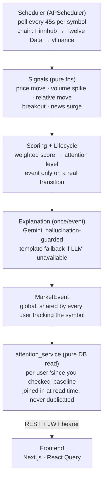

# Smart Market Watchlist

**An attention engine for your stock watchlist — not a data display tool.**

## Why this exists

Every stock app already shows price, percent change, volume, and a
chart. None of that is hard to build, and none of it answers the
question someone watching a growing list of stocks actually has: *which
of these needs my attention right now?* A watchlist that just displays
numbers gets *harder* to use as it grows — more stocks means more
numbers to manually scan, not more insight. This one inverts that: the
system decides what's worth surfacing, explains its reasoning in plain
language, and stays quiet for everything else.

## What it does

| | |
|---|---|
| **Filters noise, doesn't just display it** | Every move is scored against five weighted signals — price move, volume spike, relative-to-market move, breakout, news surge — and anything below threshold never reaches the user. A watchlist's job is triage, not decoration. |
| **Contextualizes every move against the market** | A stock up 3% on a day the benchmark is up 2.8% did nothing unusual. The same move on a flat day is real — the relative-move signal accounts for both, not just the raw percentage. |
| **Explains itself, always** | Every attention card expands into its exact signal breakdown (price/volume/relative/breakout/news, each a real number) plus a plain-English explanation — never a bare score with no reasoning behind it. |
| **Distinguishes "since you checked" from "today's move"** | Two people who added NVDA at different times see different "since you checked" numbers from the same market event — a genuine per-user baseline, not a demo fiction, kept honestly separate from the day's headline change. |
| **Tracks two markets on their own clocks** | US and Indian equities, each polled against its own market calendar — not a single US-only clock with an Indian ticker bolted on. |
| **Fails over for real, and says so** | Every provider-resilience claim in this README was live-tested against the actual endpoints, not assumed from documentation — including a provider that was built, verified, and deliberately left inactive because its real limits didn't fit the job. |

**How it's designed.** The core bet is a strict split between *global
market state* (symbols, prices, events — computed once, shared by every
user tracking that symbol) and *per-user observation state* (your own
"last checked" baseline) — that split is what makes "since you checked"
possible without duplicating work per user. Explanations (Gemini,
hallucination-guarded, with a template fallback) are generated once per
event during background ingestion, never in a user's request, so the read
path never waits on a provider or an LLM — measured at 30-70ms for
5-100 stocks, benchmarked rather than claimed. The full reasoning behind
every choice above is in [Key Design Decisions](#key-design-decisions),
[Provider resilience](#provider-resilience), and [Data model](#data-model)
below.

---

**Contents:** [Why this exists](#why-this-exists) ·
[What it does](#what-it-does) ·
[Architecture](#architecture) ·
[Core idea: global market state vs. per-user observation](#global-market-state-vs-per-user-observation) ·
[Provider resilience](#provider-resilience) ·
[Latency](#latency) ·
[Design decisions](#key-design-decisions) ·
[Data model](#data-model) ·
[Scoring](#scoring) ·
[Demo Mode](#demo-mode) ·
[Quick Start](#quick-start) ·
[Project Structure](#project-structure) ·
[API Reference](#api-reference)

---

## Architecture



Every stage is a pure, independently-testable module with one job — the
signal functions and scoring math don't know a provider or a database
exists, and the provider chain doesn't know scoring exists. Symbols are
routed to a per-market chain by ticker suffix (`.NS`/`.BO` → yfinance,
everything else → Finnhub → Twelve Data as fallback) — a genuine US +
Indian equities tracker on two separate market calendars, not a
single US-only clock with an Indian ticker bolted on.

## Global market state vs. per-user observation

The idea the whole product rests on:

```
MARKET STATE IS GLOBAL.        (symbols, snapshots, events, news)
OBSERVATION STATE IS PER-USER.  (last_observed_at, last_observed_snapshot_id)
```

Ingestion and change detection never know or care which user is looking —
one poll of NVDA serves everyone tracking it. `attention_service` is
where the two meet: it reads a user's own baseline to compute **"since
you checked"** (distinct from "today's move," which is real context but
answers a different question — two users who added NVDA at different
times see different "since checked" numbers from the same underlying
event). A symbol also doesn't re-alert on every poll just for staying
elevated — an event is only created on a real transition (new, escalated,
de-escalated), not once per poll cycle.

## Provider resilience

Three market-data providers, wired into per-market fallback chains
(`us_provider_chain` / `india_provider_chain` — comma-separated, config
not code) that walk in order and stop at the first success. Every claim
below came from live-testing the actual endpoints, not the docs:

- **Twelve Data** is a real, active US fallback — verified against real
  quotes that independently matched a second provider's numbers for the
  same symbol.
- **Alpha Vantage** is built and tested, but deliberately *not* active —
  its free tier is 25 requests/day total, confirmed live, nowhere near
  enough for a polling loop. Kept available rather than forced in because
  a key exists.
- **Twelve Data is not in India's chain** — live-tested against
  `RELIANCE.NS` and its own documented `RELIANCE:NSE`/`exchange=NSE`
  formats; all three came back with *"available starting with the Grow or
  Venture plan."* A real capability limit, confirmed rather than assumed,
  so yfinance stays India's only provider.
- **Exception-safe fallback**: a provider adapter catches its own known
  failure modes (timeout, HTTP error, rate limit, bad JSON) and moves to
  the next provider — but an unexpected exception is never silently
  treated as "provider unavailable."
- **Conflict detection, not silent averaging**: adding a new ticker
  cross-checks it against every other configured provider once; a >2%
  disagreement is returned on the API response and shown as *"Finnhub and
  Twelve Data differ by 2.8% — using Finnhub's value"* — never "incorrect
  data," since a difference can be feed timing, not necessarily either
  source being wrong.
- **Per-provider health** in `GET /api/health` (`provider_failures` keyed
  by name), not just one aggregate counter.

Volume baselines follow the same honesty principle: `is_daily_bar`
distinguishes real daily OHLCV rows from live-poll rows, since live polls
can carry intraday-cumulative or absent volume that isn't comparable to a
single day's figure.

## Latency

`GET /changes` used to be able to call Gemini synchronously — the actual
bug was explanations cached per `(user_id, event_id)` even though an
explanation doesn't depend on who's asking. Moved generation into
background ingestion, stored once per event; the read path is now a pure
DB query with no LLM or provider call possible in it, structurally.

Measured with `scripts/benchmark_changes.py` (real DB rows, no
network/LLM):

| Symbols | min (ms) | avg (ms) | max (ms) |
|---|---|---|---|
| 5   | 28.5 | 31.6 | 35.5 |
| 20  | 36.2 | 36.9 | 38.4 |
| 50  | 42.6 | 45.2 | 47.7 |
| 100 | 56.8 | 67.2 | 72.8 |

20x more symbols costs roughly 2x latency, not 20x. `useChanges`/`useQuotes`
poll every 15s while a relevant market is open, backing off to 2 minutes
when both are closed, and stop entirely on a backgrounded tab.

> Run the frontend with `npm run build && npm start` rather than `npm run
> dev` to see this for real — dev mode's per-route on-demand compilation
> adds multi-second first-visit delays a real deployment never has.
> Production: every route under 30ms, most single-digit.

## Key Design Decisions

| Decision | Rationale |
|---|---|
| **Eager scoring + explanation, during ingestion** | `GET /changes` is a pure DB read for every user, always — see Latency |
| **Real per-user auth (JWT)** | "Since you checked" needs a genuine per-user baseline, not a shared fiction |
| **Changes vs. Quotes are separate endpoints** | "What changed" (scored, filtered) and "current price" (every tracked stock, always) are different questions |
| **Dynamic ticker resolution** | Adding a company validates and resolves it live instead of matching a fixed catalog |
| **Poll gated on either market being open** | NSE and US hours barely overlap — gating on US-only would starve Indian symbols |
| **Template fallback for the LLM** | Works with no Gemini key, and survives it being rate-limited |
| **Hallucination guard** | Rejects LLM output with invented percentages before it reaches a user |
| **Commit-after-render** | Baseline only advances after the user explicitly reviews a change |
| **Polling, not WebSockets** | The product is "see what changed," not a live trading ticker — polling matches that without added infrastructure |
| **Batched attention queries** | A fixed handful of queries per request regardless of watchlist size |
| **Timezone-aware timestamps everywhere** | A naive UTC default silently gets reinterpreted as local time by this stack — fixed at the model layer |
| **One watchlist surfaced per user** | The schema supports more, but the product's actual job — triage what changed — doesn't need multi-watchlist juggling to prove the idea |
| **Conflict detection at ticker-add time, not continuous** | Cross-checking every provider on every poll would double ongoing API calls against free-tier limits for a check that matters once, at resolution time, not every 45 seconds |
| **Tests target pure functions + mocked provider failures, not live integrations** | Signal math, scoring, and the fallback chain's exception handling are exactly the logic worth pinning down in isolation; the fallback chain itself and the demo scenario are verified against the real APIs directly instead of through DB-fixture integration tests |

## Data model

`MarketEvent` is append-only — a row is written once, on a real
transition, and never updated or deleted. That's the shared signal
history, and it's what the "since you checked" replay and the "did this
symbol re-alert" dedup check both read from.

`UserObservation` is the opposite shape on purpose: exactly one row per
(user, symbol), updated in place, holding just a pointer — "last checked
at this time, against this snapshot." It's not a copy of the event log
per user; it's the single cheap fact that turns a shared, global event
into a personal "here's what changed for *you*" answer at read time.
Reviewing an alert (or a demo scenario cleaning itself up once reviewed)
is exactly this row being touched — nothing else in the system changes.

## Scoring

| Signal | Weight |
|---|---|
| Price Move | 35% |
| Relative Move (vs. market) | 25% |
| Volume Spike | 20% |
| News Surge | 10% |
| Breakout | 10% |

Corroboration boost: 2 signals agreeing → +5%, 3 → +10%, 4+ → +15%.
Attention levels: CRITICAL (≥0.70) · HIGH (≥0.40) · WATCH (≥0.15).

## Demo Mode

**Settings → Demo Mode → "Run demo scenario"** seeds a deterministic "you
were away for 4h12m" scenario — NVDA +7.8% on 3.2x volume with a news
spike, TSLA -3.1%, MSFT +2.4%, plus two quiet stocks for contrast —
through the real ingestion → scoring → explanation pipeline. Nothing is
pre-baked and no external API calls are made, so it's fully offline and
identical every time.

---

## Quick Start

### Prerequisites
- Docker Desktop, Python 3.9+, Node.js 18+
- A [Finnhub](https://finnhub.io) API key (free tier)
- A Gemini API key (optional — template fallback works without it)

```bash
# 1. Database
docker compose up -d

# 2. Backend
cd backend
cp .env.example .env   # set FINNHUB_API_KEY, JWT_SECRET_KEY, optionally GEMINI_API_KEY
python -m venv .venv && .venv/Scripts/activate   # .venv/bin/activate on macOS/Linux
pip install -r requirements.txt
python scripts/seed.py   # idempotent — seeds symbols + demo@smartwatchlist.dev / demo12345
uvicorn app.main:app --reload

# 3. Frontend
cd ../frontend
cp .env.local.example .env.local
npm install
npm run dev   # or: npm run build && npm start for production-accurate latency
```

Open `http://localhost:3000` — sign up, or log in with the demo account.

Run tests: `cd backend && pytest -v`. Reproduce the latency table:
`python scripts/benchmark_changes.py`.

---

## Project Structure

```
backend/app/
├── engine/          signals.py, scoring.py, market_calendar.py
├── providers/       base.py + finnhub, yfinance, twelve_data, alpha_vantage
├── services/        ingestion, attention, explanation, observation, watchlist, demo
├── routers/         auth, health, watchlists, dashboard
├── llm/             Gemini client + template fallback + hallucination guard
└── scheduler/       APScheduler jobs

frontend/src/
├── app/             page.tsx (dashboard), login/, signup/, watchlists/, settings/, stocks/[symbol]/
├── components/       AttentionCard, MarketPulse, MarketOverview, Sidebar, ...
├── hooks/           useChanges, useQuotes, useCandles, ...
└── lib/             api.ts, types.ts
```

---

## API Reference

| Method | Endpoint | Description |
|---|---|---|
| POST | `/api/auth/signup` / `/login` | Account creation / JWT |
| GET | `/api/health` | DB status + real ingestion/provider counters |
| GET/POST | `/api/watchlists` | List / create watchlists |
| GET | `/api/watchlists/{id}/changes` | Ranked, scored attention items |
| GET | `/api/watchlists/{id}/quotes` | Live price for every tracked symbol |
| POST | `/api/watchlists/{id}/symbols` | Add a symbol — live-resolved, includes `provider_conflict` if providers disagreed |
| GET | `/api/stocks/{symbol}/candles` | Historical price points |
| POST | `/api/observations/commit` | Advance "last checked" baseline |
| GET | `/api/dashboard` | Per-user summary + market hours |
| POST | `/api/admin/demo-scenario` | Seed the demo scenario |

---

**Smart Market Watchlist** — not a data display tool. A triage system
for your attention.
